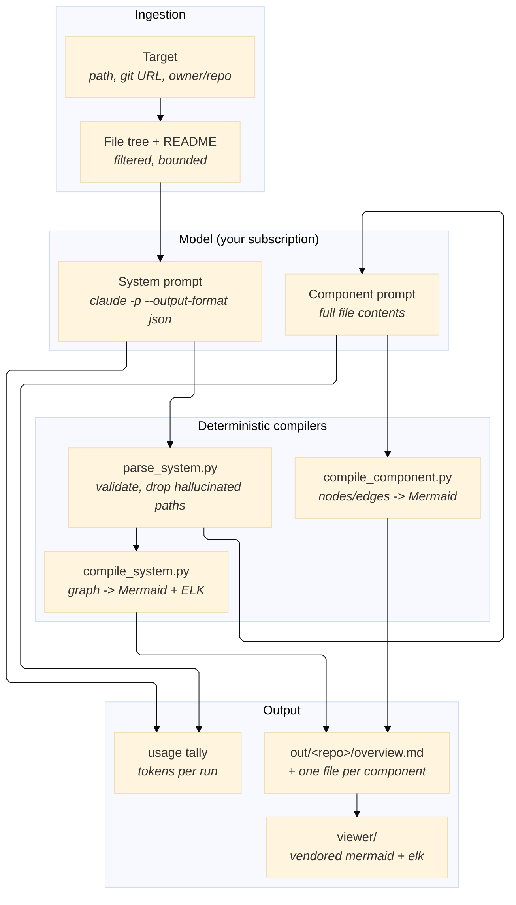
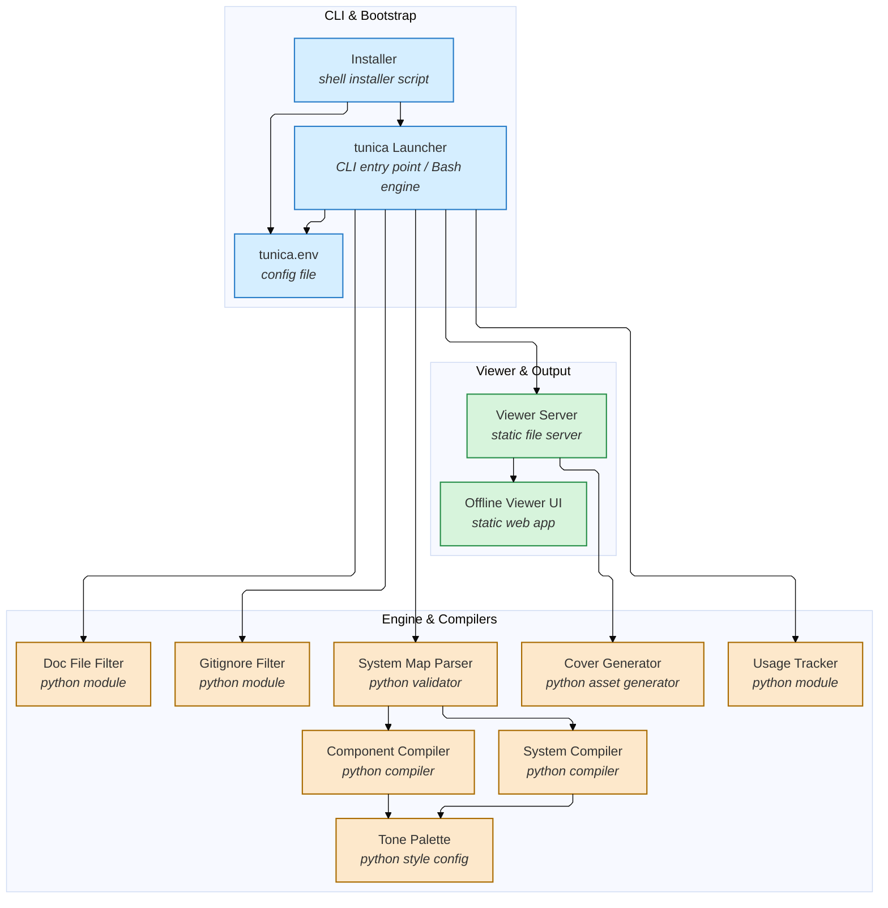
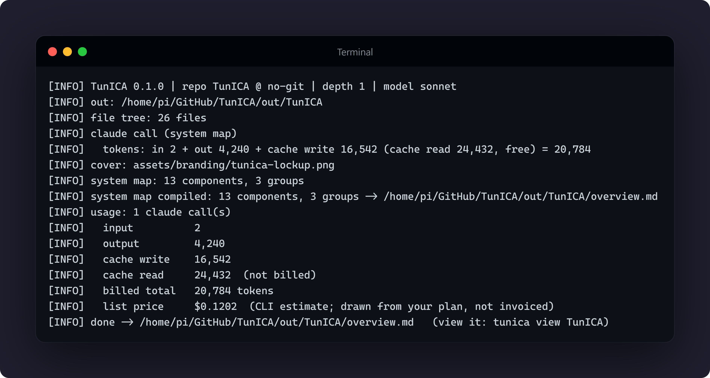
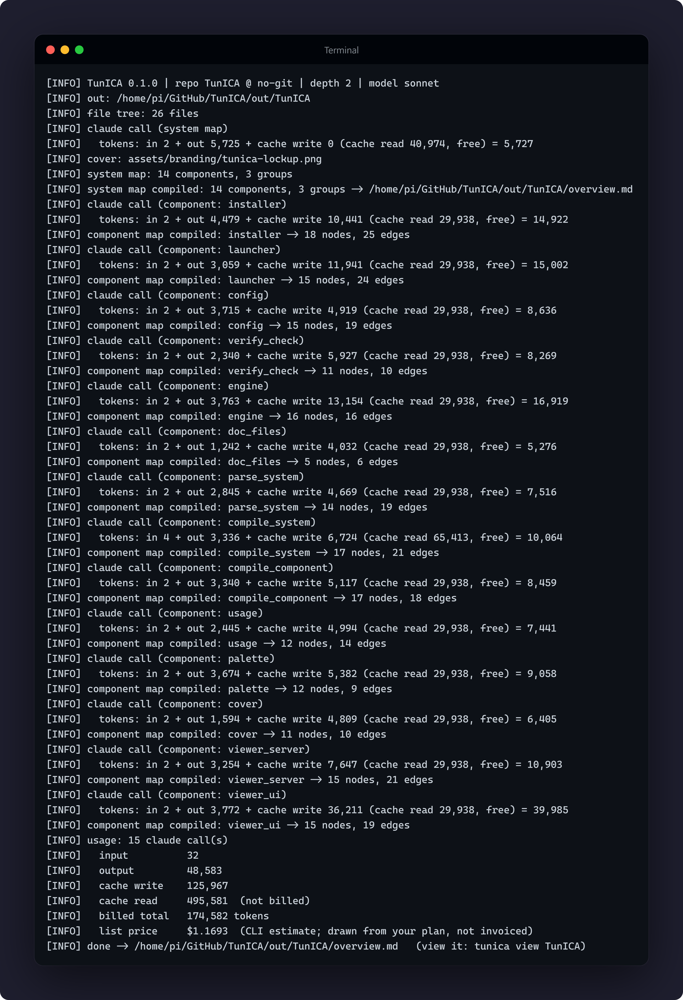
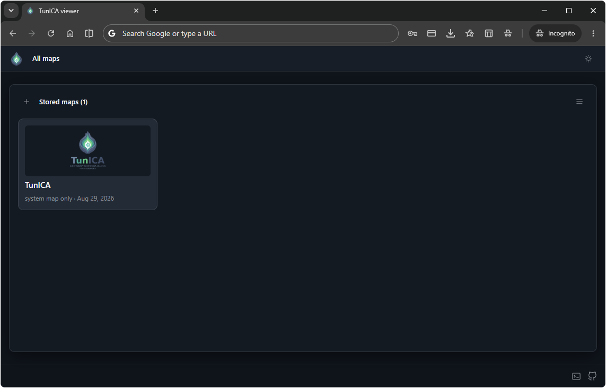
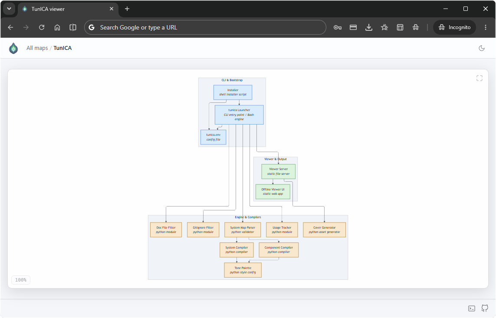

<div align="center">
  
</div>

# Independent Component Analysis for Codebases

[](https://github.com/Arelius-D/TunICA/releases) [](https://github.com/Arelius-D/TunICA/blob/main/LICENSE) [](#) [](#) [](#)

> **Version:** 1.0.1
> **Core Philosophy:** "The map is accountable to the code."

A diagram is only worth reading if it is evidence. TunICA derives its maps from the codebase itself, not from a model's impression of a README: every component names the files it was built from, every component map is drawn from the contents of those files, and any path the model invents is dropped before it can reach the page.

*tunica*: the concentric coats of a bulb. Peeling is the method, layer by layer, but the promise is traceability.

---

## 1. What is TunICA?

TunICA turns any repository into layered architecture diagrams using **the Claude CLI you already have installed and logged in**. It builds the prompts, hands them to `claude -p`, validates what comes back against the real file tree, and compiles it into Markdown with Mermaid diagrams.

There is no API key to obtain, no account to create, no server to call, and no rate limit imposed by anyone but your own plan. The engine is a Bash script and eight small Python modules; the viewer is a static page with Mermaid and the ELK layout vendored locally, served by a Python file server.

---

## 2. Why TunICA Exists

### A. The Lockout Problem

Hosted diagram tools bill the maintainer for every visitor, so they must ration you.

- **The Problem:** a few generations per hour per IP, a shared daily token pool, a cap on repository size, and a "come back later" message. Behind CGNAT you may be rationed by strangers' usage before you start.
- **The TunICA Solution:** the model call happens on your machine, against your own authenticated CLI. The only limit is the plan you already pay for.

### B. The Depth Problem

Tools that map from a file tree alone can only ever draw one flat picture.

- **The Problem:** a file listing plus a README tells a model what files exist, not what the code does. The result is one diagram of ~30 boxes, no matter how large the system.
- **The TunICA Solution:** two layers. The system map is drawn from the tree, then every component is mapped again from **the full contents of its files**: functions, sections, and the call flow between them.

### C. The API Key Problem

"Bring your own key" means bring your own invoice.

- **The Problem:** a subscription (Claude Max, Pro) is not an API key. Tools that accept only API keys ask you to pay a second time, per token, for capacity you already own.
- **The TunICA Solution:** the vendor's own CLI is the backend. Your subscription pays, exactly as it does when you use the CLI directly.

### D. The Offline Problem

A viewer that fetches its own renderer can draw nothing without a network, and tells someone else every time you read a diagram.

- **The Problem:** most Mermaid viewers pull the renderer from a CDN, so your architecture diagrams are unreadable without internet and observable by whoever hosts the script.
- **The TunICA Solution:** Mermaid and the ELK layout engine are vendored into `viewer/vendor/`. Nothing needed to render a map is fetched at runtime. The viewer's only outbound request is the update check on the footer's GitHub glyph, which asks `api.github.com` for the latest published Release, sends nothing of yours, and reports itself unavailable rather than guessing when it fails.

---

## 3. Core Architecture



### TunICA, mapped by TunICA

The diagram below is not drawn by hand. It is this repository's own `overview.md`, produced by running TunICA against itself and refreshed with every release, and it lives in [docs/self-map/](docs/self-map/).

<!-- selfmap:start -->



<!-- selfmap:end -->

1. **Ingestion:** a local path is read in place; a URL or `owner/repo` is cloned shallow into a temporary directory and deleted when the run ends. Binaries, lock files, vendor directories and build output are filtered out.
2. **System map:** one call returns a strict JSON graph: groups, components, kinds, files, and flow direction.
3. **Validation:** `lib/parse_system.py` drops any path that is not in the real tree and any edge pointing at a component that does not exist, and separates ids that collide so nothing is silently merged.
4. **Component maps:** at depth 2, each non-documentation component gets its own call carrying the full text of its files, and returns nodes plus labelled edges.
5. **Compilation:** the compilers emit Mermaid with ELK layout, subgraph grouping, a fixed tone palette and click-through navigation. Nothing about the drawing is left to the model.
6. **Accounting:** every call is made with `--output-format json`, so the run reports exactly what it spent.

---

## 4. Installation & First Run

### Requirements

| Tool | Why |
| :--- | :--- |
| `claude` (Claude Code CLI), logged in | the model backend; TunICA never asks for an API key |
| `bash`, `python3` | the engine and its compilers |
| `git` | only for URL / `owner/repo` targets |

### Install

```bash
curl -fsSL https://raw.githubusercontent.com/Arelius-D/TunICA/main/install.sh | bash
```

The installer downloads TunICA itself: nothing to clone, nothing to build.

The installer is **user space only**: no `sudo`, nothing written outside your home. It asks where to install (default `~/TunICA`), asks three onboarding questions into `tunica.env` (model, where maps go, and the viewer port), and offers a `tunica` alias per shell rc file it finds (`.zshrc`, `.bashrc`, `config.fish`, `.profile`), in a marked block it can remove again. Nothing is written to `~/.local/bin` and nothing is added to your `PATH`.

```bash
./install.sh --check       # verify an installation and its dependencies
./install.sh --update      # update in place, keeping .env and your maps
./install.sh --uninstall   # remove it, with your maps kept unless you say otherwise
./install.sh -h            # every flag
```

### First run

```bash
tunica ~/GitHub/some-repo     # map a local repository
tunica view                   # open the result in a browser
```

With no reverse proxy in front of it, `tunica view` prints `http://127.0.0.1:8866/`
and serves on loopback. Over SSH it binds every interface instead and lists the
addresses it can be reached at.

A whole run, start to finish, with what it spent. At depth 1 that is one call:



At depth 2 it is one call for the system map and one for each component:



---

## 5. Usage & CLI Flags

```bash
tunica <repo-path|git-url|owner/repo> [options]
tunica view [name] [port]
tunica remove <name> [-y]
tunica service <install|remove|status> [name] [port]
```

| Flag | Meaning |
| :--- | :--- |
| `-d 1\|2` | depth: 1 = system map only, 2 = system map + one map per component (default) |
| `-o DIR` | write this run's map to a specific directory |
| `-m MODEL` | model passed to `claude --model` (`sonnet`, `opus`, `haiku`, or a full id) |
| `-q` | quiet: log to file only |
| `-v` | print version |
| `-h` | help |

`tunica service <install|remove|status>` is separate from the flags above: it is asked for once, not passed per run. See **Keeping the viewer up**.

Examples:

```bash
tunica ~/GitHub/LucID                  # local, full depth
tunica Arelius-D/Cerebro               # clone from GitHub, map, delete the clone
tunica https://github.com/user/repo -d 1 -m haiku
tunica view LucID 9000                 # serve one map on a chosen port
tunica remove LucID                    # delete a stored map, after confirming
```

`remove` deletes one stored map and everything under it, after confirming. `-y` answers for
scripts; with no terminal to ask at, it refuses rather than assuming.

---

## 6. Configuration Guide

Settings live in `tunica.env`, which ships with TunICA and sits beside the script. Every line in it is commented out, so an untouched file means every built-in default applies; the installer fills in your onboarding answers. Precedence, highest first: **command-line flag → shell environment → `tunica.env` → built-in default.**

| Variable | Default | Purpose |
| :--- | :--- | :--- |
| `TUNICA_OUT_ROOT` | `<install dir>/out` | root for generated maps; each run writes `<root>/<repo-name>/` |
| `TUNICA_LOG_FILE` | `<install dir>/tunica.log` | operations log |
| `TUNICA_LOG_MAX_DAYS` | `14` | days of log history to keep; `0` disables pruning |
| `TUNICA_MODEL` | `sonnet` | model passed to `claude --model` |
| `TUNICA_CLAUDE_BIN` | auto-detected | path to the Claude CLI |
| `TUNICA_TIMEOUT` | `600` | seconds allowed per model call |
| `TUNICA_DEPTH` | `2` | default depth |
| `TUNICA_MAX_FILES` | `4000` | refuse repositories larger than this |
| `TUNICA_MAX_FILE_BYTES` | `60000` | bytes of a single file sent to the model |
| `TUNICA_MAX_COMPONENT_BYTES` | `120000` | bytes of one component's files combined |
| `TUNICA_VIEW_PORT` | `8866` | port used by `tunica view` |
| `TUNICA_VIEW_BIND` | `auto` | which interface the viewer listens on: `auto` binds every interface over SSH and loopback locally; or force `0.0.0.0`, `127.0.0.1`, or one specific address |
| `TUNICA_VIEW_ALLOW_GENERATE` | `false` | let the viewer page map a repository and remove a stored map. Off by default: a run spends your tokens and clones what it is given, and a removal is permanent |
| `TUNICA_VIEW_URL` | unset | public address to print instead of `host:port`, for a host behind a reverse proxy |

---

## 7. What You Get

```text
out/<repo-name>/
  overview.md          the system map: groups, components, flow, clickable
  <component>.md       one per component: its functions and their call flow
  .work/               prompts, raw responses, envelopes, graph.json, file tree
```

Every `.md` is plain Markdown with a Mermaid block, so it renders in VS Code, on GitHub, in Obsidian, or in the bundled offline viewer. `.work/` lets a map be recompiled without another model call, and is safe to delete.

---

### The viewer

`tunica view` serves every map this installation holds as a card index, in a grid or in
rows, whichever you choose, remembered between visits. Each card carries the repository's
own README image as its cover, how many component maps it holds, and when it was made.



Opening one gives you the map itself. At depth 2 every component is a door: opening one
swaps the drawing in place, and the trail in the header leads back out.



Two themes, dark and light, chosen by the glyph in the header and remembered; with no
choice made yet, the page follows your system.

With `TUNICA_VIEW_ALLOW_GENERATE=true` the page can also map a repository, remove a stored
map, and run an update when the GitHub glyph reports a newer Release. Off by default, because
anything that can reach the port can then spend your tokens on a run or permanently delete a
map. An update spends nothing and deletes nothing: it replaces the engine files and keeps your
maps and your `tunica.env`. Everything the page can do, the command line can do.

### Keeping the viewer up

`tunica view` is a foreground server: it runs until you press Ctrl+C. It ends with the terminal that started it. The maps are files and outlive it.

If you want it to come back on its own, ask for it once:

```bash
tunica service install          # write and enable a systemd --user unit
tunica service status           # what is installed, if anything
tunica service remove           # take it back out
```

Nothing is installed by default and nothing here uses `sudo`: the unit lands in `~/.config/systemd/user/`, not in `/etc`. Two things it will tell you about:

- **Lingering.** A user manager stops when you log out, so on a headless host the service dies with your SSH session unless lingering is on. `install` checks, and prints `loginctl enable-linger <you>` if it is off. That is the only command here that may ask for a password.
- **`TUNICA_VIEW_BIND=auto` means loopback under a service.** `auto` decides by looking for an SSH session, and a service has none, so it binds `127.0.0.1` and answers nobody on the network. Set `TUNICA_VIEW_BIND=0.0.0.0` in `tunica.env` and restart the unit.

Updating differs too. With a service running, `install.sh --update` and the viewer's update button both replace the files under a process that keeps running the old ones; both then tell you to run `systemctl --user restart tunica.service` rather than to restart a terminal.

### Reaching the viewer from another machine

On a headless host the viewer binds every interface and prints one URL per address.

Behind an existing reverse proxy, point it at the port and set `TUNICA_VIEW_URL` so the printed link is the public one. A proxy expects its upstream to be there; pair it with `tunica service install`, or the first request after you close your terminal is a 502. Note the upstream address: a proxy running in a container usually cannot reach the host's `127.0.0.1`, and needs the docker bridge gateway instead.

Two instances, two routes. The installed one and a development checkout are separate installations with their own `tunica.env`, map root and port.

```caddyfile
yourdomain.com {
    # the installed instance: ~/TunICA, TUNICA_VIEW_PORT=8866
    handle /tunica/* {
        uri strip_prefix /tunica
        reverse_proxy 172.17.0.1:8866     # docker bridge gateway, not 127.0.0.1
    }

    # the dev checkout: ~/GitHub/TunICA, TUNICA_VIEW_PORT=8867
    handle /tunica-dev/* {
        uri strip_prefix /tunica-dev
        reverse_proxy 172.17.0.1:8867
    }
}
```

Set the port per instance in each one's own `tunica.env`, and `TUNICA_VIEW_URL` to the route it is served at:

```bash
# ~/TunICA/tunica.env
TUNICA_VIEW_PORT="8866"
TUNICA_VIEW_URL="https://yourdomain.com/tunica"

# ~/GitHub/TunICA/tunica.env
TUNICA_VIEW_PORT="8867"
TUNICA_VIEW_URL="https://yourdomain.com/tunica-dev"
```

Keep the installed one up with `tunica service install`. The dev one is started and stopped by hand as you work; the two are independent.

```bash
TUNICA_VIEW_BIND=0.0.0.0 TUNICA_VIEW_URL=https://yourdomain.com/tunica tunica view
```

The viewer is a static file server with no authentication.

---

## 8. Token Accounting

Every run ends with exactly what it cost:

```text
[INFO] usage: 11 claude call(s)
[INFO]   input          2,140
[INFO]   output         14,908
[INFO]   cache write    98,204
[INFO]   cache read     366,663  (not billed)
[INFO]   billed total   115,252 tokens
[INFO]   list price     $0.7314  (CLI estimate; drawn from your plan, not invoiced)
```

Cache reads are free and reported separately, outside the billed total. Per-call figures are kept in `out/<repo>/.work/usage.json`.

---

## 9. Troubleshooting & FAQ

**Q: `claude CLI not found`.** Install the Claude Code CLI and log in, then either let TunICA auto-detect it or set `TUNICA_CLAUDE_BIN` in `.env`. Run `./install.sh --check` to confirm.

**Q: The diagram renders as a scattered mess in my editor.** Your Markdown preview is ignoring the ELK layout declaration. Use `tunica view` instead; the bundled viewer uses the engine the diagrams are designed for.

**Q: The model refused a component.** It happens when a component's description does not match its file contents. The raw reply is kept in `.work/<component>.response.txt`; fix the description in `.work/graph.json`, then recompile that one component from what is already on disk, with no new model call:

```bash
python3 lib/compile_component.py out/<repo>/.work/<component>.response.txt out/<repo> <component>
```

**Q: What leaves my machine?** The files being mapped go to your own Claude CLI, exactly as if you had pasted them in yourself. Nothing else leaves. There is no telemetry and no analytics. The one third party the viewer contacts is `api.github.com`, for the update check described in §2D, and it carries none of your data.

**Q: How much does a repository cost to map?** A small repository at depth 1 is one call. Depth 2 is one call per code component. The run prints the exact number of tokens either way.

---

## 10. Contributing

Issues and pull requests are welcome. Keep changes focused, run `./install.sh --check` before opening one, and describe what you verified.

---

## 11. Acknowledgements

Inspired by [GitDiagram](https://github.com/ahmedkhaleel2004/gitdiagram) by [@ahmedkhaleel2004](https://github.com/ahmedkhaleel2004).

Diagrams are rendered with [Mermaid](https://github.com/mermaid-js/mermaid) and the [ELK layout](https://github.com/mermaid-js/mermaid/tree/develop/packages/mermaid-layout-elk), both vendored locally so the viewer works offline.

---

## 12. License

Distributed under the GNU Affero General Public License v3.0 only. Run it, self-host it, modify it freely, but if you offer a modified TunICA to others over a network you must publish your modifications under the same license. See [LICENSE](LICENSE) for the full text.

The vendored renderer in `viewer/vendor/` is Mermaid and its ELK layout, both MIT, and they keep their own licenses.
