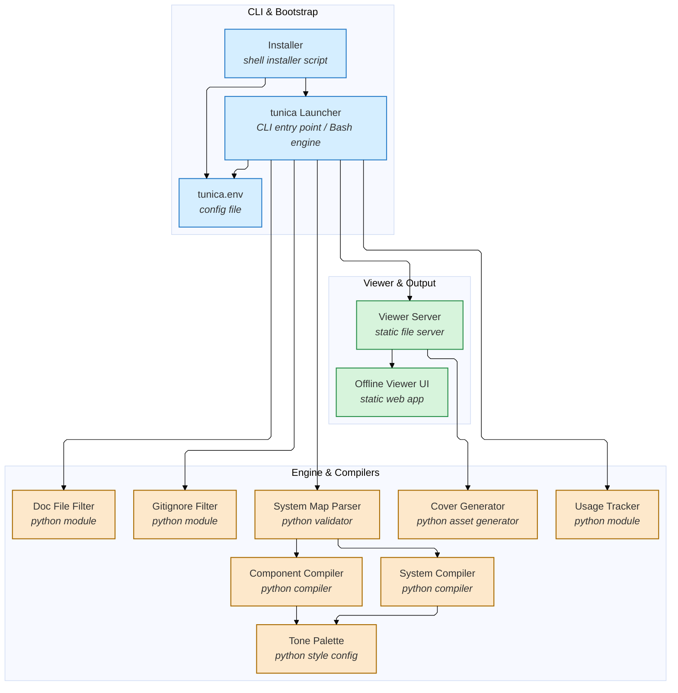

# TunICA

> TunICA 0.1.0 | backend: claude -p --model sonnet (your subscription) | repo: TunICA @ no-git | 2026-08-29 02:36

TunICA is a Bash-and-Python pipeline that turns a repository into layered Mermaid architecture diagrams using the user's own Claude CLI. tunica.sh orchestrates filtering and validation modules that call the model, then deterministic Python compilers turn the validated graph into Markdown/Mermaid maps rendered by a vendored offline viewer. install.sh bootstraps the whole tool into user space and writes the tunica.env config the launcher reads at runtime.

## Components

| Component | Kind | Files | Description |
| :-- | :-- | :-- | :-- |
| Installer | shell installer script | `install.sh` | Installs, updates, checks, and uninstalls TunICA entirely within user space, writing tunica.env from onboarding answers. |
| tunica Launcher | CLI entry point / Bash engine | `tunica.sh` | Parses CLI flags, reads configuration, drives ingestion and the model calls, and dispatches to the Python filters, validators, compilers, and viewer server. |
| tunica.env | config file | `tunica.env` | Commented-out default settings for output paths, model, timeouts, and viewer options, overridden by flags or shell env. |
| Doc File Filter | python module | `lib/doc_files.py` | Filters binaries, lock files, vendor directories, and build output from the repository tree before it is sent to the model. |
| Gitignore Filter | python module | `lib/gitignored.py` | Parses .gitignore rules to exclude ignored paths from the ingested file tree. |
| System Map Parser | python validator | `lib/parse_system.py` | Validates the model's system-map JSON against the real file tree, dropping hallucinated paths, dangling edges, and duplicate ids. |
| System Compiler | python compiler | `lib/compile_system.py` | Compiles the validated system graph into overview.md as a Mermaid diagram with ELK layout, subgraphs, and click-through navigation. |
| Component Compiler | python compiler | `lib/compile_component.py` | Compiles each component's model-returned nodes and labelled edges into its own Mermaid component map. |
| Tone Palette | python style config | `lib/palette.py` | Provides the fixed set of node tones used consistently by both compilers when styling diagrams. |
| Usage Tracker | python module | `lib/usage.py` | Records tokens and cost for every claude CLI call and writes the run's usage.json tally. |
| Cover Generator | python asset generator | `lib/cover.py` | Generates a repository cover image used as a card thumbnail in the viewer's index. |
| Viewer Server | static file server | `viewer/serve.py` | Serves stored maps as a card index and the offline viewer UI, optionally handling in-page map generation and removal. |
| Offline Viewer UI | static web app | `viewer/index.html`, `viewer/styles.css`, `viewer/theme.js`, `viewer/viewer.js`, `viewer/package.json` | Renders Mermaid/ELK maps offline with pan, zoom, fullscreen, theming, and click-through drill-down into component maps. |

